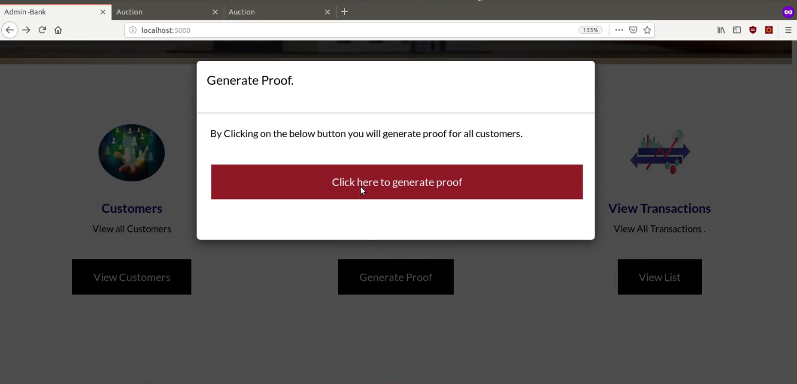

# AuctionhouseBank

AuctionhouseBank API for Auctionhouse POC

# Getting started

These instructions will get you a copy of the project up and running on your local machine.

# Prerequisites

> Install Nodejs version >= 8.10.0

> Install npm version >= 3.5.2

> Install ethereum composer ( https://mphasisblockchain@bitbucket.org/blockchainmphasisteam/ethereumcomposer.git)

> Setup and run ethereum chain. Please use rpc port as 22002 while setting up chain.

> Install and start mongodb. Use default mongodb port. If you are using custom port then change the mongodb port in config.json.


# Installing

### Clone the repository

```
$ git clone https://mphasisblockchain@bitbucket.org/blockchainmphasisteam/auctionhousebank.git

```

### Install dependencies

```
$ cd auctionhousebank/
```

```
$ npm install
```

# Run API

### NOTE

> Default configuration of API can be changed in config.json file.
> The API listens at port 5000.

> Please check rpc port in config.json before executing following commands. Make sure that ethereum rpc API listens at the port mentioned in the config.json

### Register customers

```
$ node registerCustomers.js
``` 

> You can stop the program once registration is completed.


### Deploy BalanceProof contract

> Add ethereum wallet address and password in place of $walletAddress and $password.
> Add RPC IP/Ip address(e.g. localhost/127.0.0.1 ) and RPC Port(e.g. 22002 ) in place of $RPCIP and $RPCPort. 

> For more help execute --> ``` $ node deployContract.js```

```
$ cd lib/DeployContract
```

```
$ node deployContract.js BalanceProof.sol BalanceProof.json BalanceProof 30000000 $walletAddress $password $RPCIP $RPCPort BalanceProofContract.json
```

### Start the API

```
$ cd ../..
```
> Make sure you are in the auction house bank project folder. Now run app.js.

```
$ node app
```

# Usage

> Access auction house bank portal at http://localhost:5000


